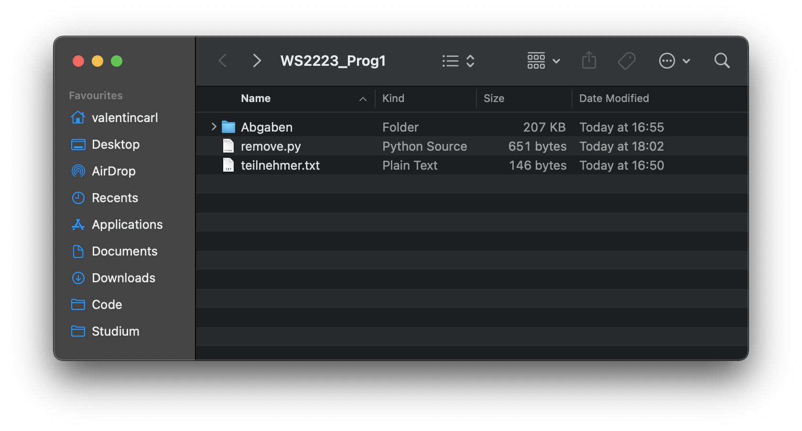

# Moodle Submissions Util

**Idee:** Kurzes Programm das alle Abgaben entfernt, die nicht von Leuten aus einer Teilnehmerliste sind.

## Ausgangspunkt

Benötigt wird ein Ordner, in dem alle Abgaben aus einem Kurs für eine bestimmte Aufgabe enthalten sind. Moodle Systeme erstellen, wenn alle Abgaben auf einmal heruntergeladen werden, für jeden Teilnehmer einen Ordner, der mit dem jeweiligen Namen anfängt. Das Programm benutzt eine Teilnehmerliste aus einer Datei `teilnehmer.txt`, in der alle Namen der Leute drin stehen, deren Abgabe behalten werden soll. Dafür reicht es, jeden Namen in jeweils eine Zeile der Textdatei zu schreiben (und Groß- und Kleinschreibung zu beachten).



## Ausführen

Zum Ausführen einfach **alle** Abgaben in einen Ordner `Abgaben` im selben Verzeichnis legen und das Skript ausführen. Übrig bleiben nur die Abgaben der Leute, die in der Teilnehmerliste stehen.

```
python3 remove.py
```

## Optionen

Innerhalb des Skipts können zwei Optionen angepasst werden. Wenn das Skript selbst nicht im Selben Verzeichnis sein soll oder die Dateien anders heißen, können die Datenpfade der Teilnehmerliste und des Abgabenordners angepasst werden.

```python
teilnehmerliste = 'teilnehmer.txt'
abgabenordner   = 'Abgaben'
```

Dafür statt `teilnehmer.txt` bzw `Abgaben` einfach den gesamten Dateipfad angeben und ausführen.
